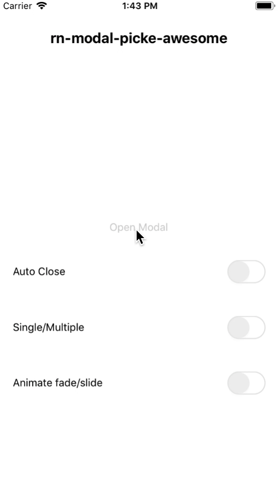
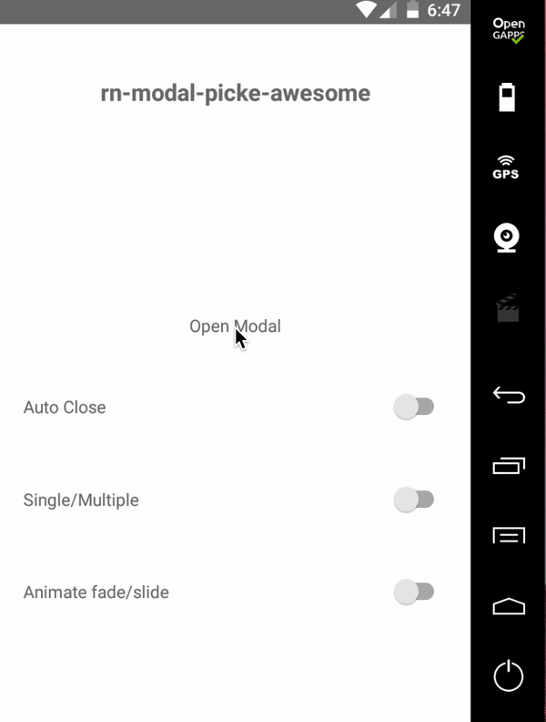

# React Native Modal Picker Awesome


##### React Native Modal Picker Component , Enable Single, Multi Selection , auto close Modal 
 - The Modal is Smart enough to close automatioc in both [ single, multi ] Selection
 - all section of component is reusable for developer customize
 - hope this help :)
##### Ios
 

##### Android
 

 <hr />

 #### usage
```
<Modal
    onSelectOption={(option) => console.log('@option/options', option)}
    modalOptions={[
    {name:'Option 1', value:'1'},
    {name:'Option 2', value:'2'},
    {name:'Option 3', value:'3'},
    {name:'Option 4', value:'4'},
    {name:'Option 5', value:'5'},
    ]}
    visible={this.state.visible}
    autoClose={true}
    multiple={false}
/>
```


### Installation
make sure you have installed react-native-vector-icons & linked it :) , or install 
```sh
$ yarn add react-native-vector-icons || npm i --save react-native-vector-icons
Then link
$ react-native link react-native-vector-icons
```
#### install the package

```sh
$ yarn add rn-modal-picker-awesome
or
$ npm i --save rn-modal-picker-awesome
```

### Modal Functions

| name | purpose |  usage |
| ------ | ---- | --------------------- |
| onSelectOption | this func help to get selected [ option, options] depend on your multiple case | onSelectOption={(option) => console.log('@Option/options ',option)} |

### Modal Props
| name | default | usage | description | type |
| ----- | ----- | ----- | ----- | --- |
| visible | false | visible={true/false}| show/hide Modal | bool
| multiple | false | multiple={false/true} | if true enable multi select options | bool
| autoClose | false | visible={false/true}| close automatic after select option in case multiple={false} otherwise will close automatice after all options has been selected in case multiple={true} | bool
|modalOptions | [{ name:'Option 1', value: '1' }, ...] | modalOptions=[{name:'', value:''},{...},...etc] | modal Options Prop must be an array of objects contains name & value | array
| selectedOptions | null | selectedOptions=[{value:'1'},{...}] | works only with multiple selection , and this will mark your values as selected , | array |
| selectedOption | null | selectedOption={{value:'1' }} | works only with single selection | Object
| animateType | 'slide' | animateType='slide' | change modal animation from [ 'slide', 'fade' ] | string
| modalBackground | '#fff' | modalBackground='#ccc' | change modal background color | string |
| modalHeaderBackground | '#fff' or modalBackground if changed | modalHeaderBackground='#eee' | modal header by default inherit the modalBackground color, but in case you need to change it seperately , do it  :)| string
|closeIconName| 'ios-close-circle-outline' | closeIconName='name-of-icon' | this will change your icon , here is list of icons can be used [IonicIconsList](https://ionicframework.com/docs/ionicons/)| string
| closeIconText | 'Close' | closeIconText='string' | change the close icon text | string
| closeIconStyle | {} | closeIconStyle={{}} | overwrite the style of close icon with new style| object
| closeIconTextStyle | {} | closeIconTextStyle={{}} | overwrite the style of close icon text with new style| object |
| doneIconName | 'ios-checkmark-circle-outline' | doneIconName='name-of-icon' | this will change your icon , here is list of icons can be used [IonicIconsList](https://ionicframework.com/docs/ionicons/)| string
| doneIconStyle | {} | doneIconStyle={{}} | overwrite the style of done icon with new style | object
| doneIconTextStyle | {} | doneIconTextStyle={{}} | overwrite the style of done icon text with new style | object |
| doneIconText | 'string' | doneIconText='string' | change the done icon text | string
| titleStyle | {} | titleStyle={{}} | overwrite style of title with new style | object
| titleText | 'Title Of Modal' | titleText='string' | change title of header | string
| optionContainerStyle | {} | optionContainerStyle={{}} | change style of option Conatiner | object
| optionTextContainerStyle | {} | optionTextContainerStyle={{}} | change style of optionText View| object
| optionTextStyle | {} | optionTextStyle={{}} | change style of option text | object
| optionCircleColor | '#4caf50' | optionCircleColor='color' | change the color of circle | string
| optionCircleInnerColor | '#4caf50' | optionCircleInnerColor='color' | inner circle will inherit color from the main circle, but in case want to change , do it :) | string
